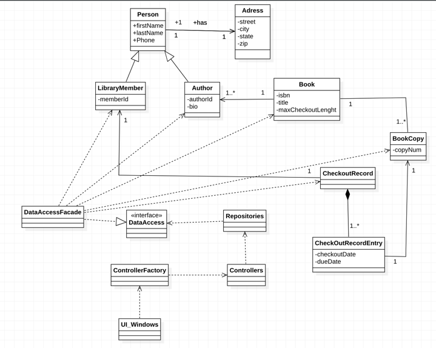
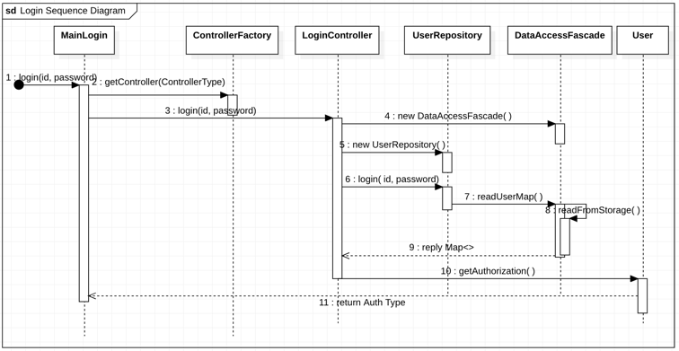
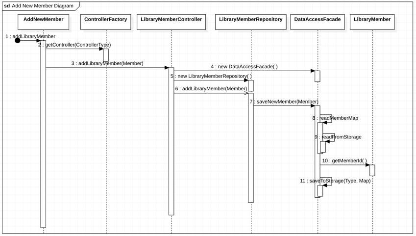
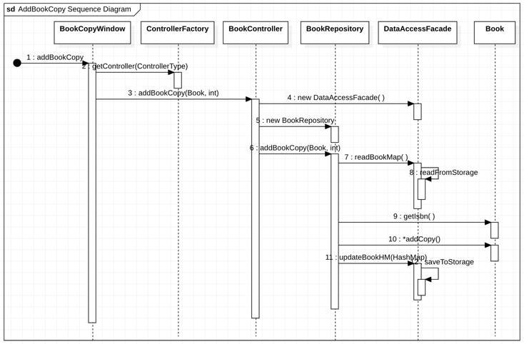
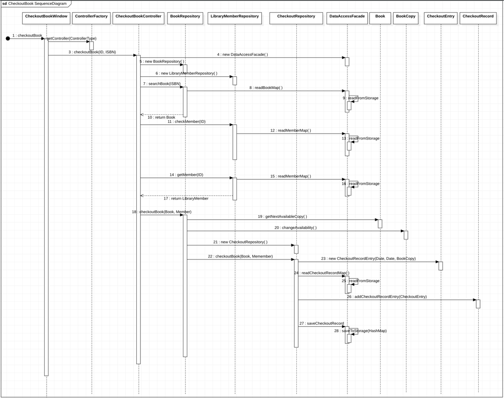

# Library System

# CS-401 Modern Programming Practice

## Group-II
* KHUN SOE MOE AUNG
* ELIZABETH

## **## 1. Use Case Diagram**

## **## **2. System Design****
* MVC Pattern
* Factory Pattern
* Use Case Controller Pattern
* Repository Pattern

## ****## **UML Diagrams******

### **1. Class Diagram**

## 2. Sequence Diagrams

### (i) Login

### (ii) Add New Member

### (iii) Add Book Copy

### (iv) Checkout Book

   